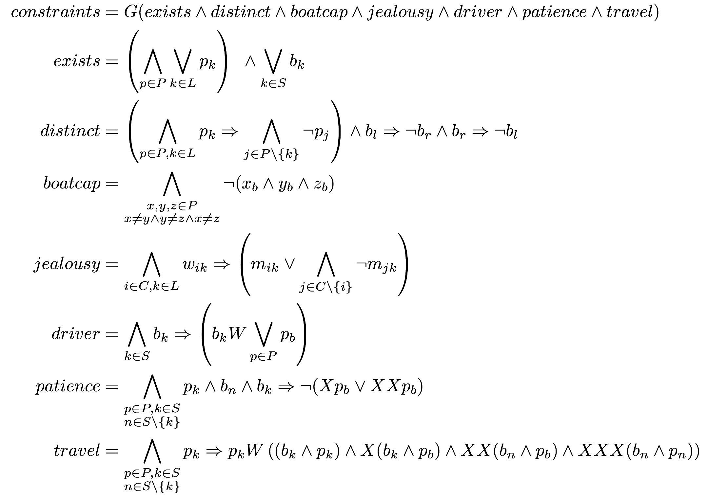

LTL Model Checker
=================

This is a Scala library for specifying and model checking formulas in [Linear Temporal Logic](http://en.wikipedia.org/wiki/Linear_temporal_logic).

There is a DSL defined in Problem.scala that allows for a mildly succinct representation of complex LTL formulas.
You can find two example problems in Problem.scala as well (one quite simple, the other pretty complex).

You can use sbt to run it. Modify LTL.scala to change the run options. Command-line arguments are TODO.

Z3 is a requirement. `brew install z3` is sufficient on a Mac.

DSL
---

For an example of using the LTL DSL, consider the following formulation of a problem in which six people are attempting to cross a river in a boat that holds at most two people at a time.
Also, the six people are 3 couples, with jealous husbands, such that no woman may be around another man without also being around her husband.
The boat cannot cross the river without someone in it.



*Note that b_k in patience should be Xb_k.*

This can be encoded in the DSL as follows:

```scala
    val exists = /\(for (p <- P) yield \/(for (k <- L) yield p + k) /\ \/(for (k <- S) yield b + k))
    val distinct = /\(for (p <- P; k <- L) yield (p + k) -> /\(for (j <- L - k) yield ¬(p + j)) /\ ((b + l) -> ¬(b + r)) /\ ((b + r) -> ¬(b + l)))
    val boatcap = /\((for (p <- P) yield p + b).toSeq.combinations(3).map(/\).map(¬))
    val jealousy = /\(for (k <- L; i <- C) yield (w + i + k) -> ((m + i + k) \/ (/\(for (j <- C - i) yield ¬(m + j + k)))))
    val driver = /\(for (k <- S) yield ->(b + k, W(b + k, \/(for (p <- P) yield (p + b)))))
    val patienke = /\(for (k <- S; p <- P; n <- S - k) yield ((p + k) /\ (b + n) /\ X(b + k)) -> ¬(X(p + b) \/ X(X(p + b))))
    val travel = /\(for (k <- S; p <- P; n <- S - k) yield (p + k) -> W(p + k,
      ((b + k) /\ (p + k)) /\ //the boat is here
        X((b + k) /\ (p + b)) /\ //i get on the boat
        X(X((b + n) /\ (p + b))) /\ //i go to the other side
        X(X(X((b + n) /\ (p + n)))))) //i get off the boat

    val constraints = G(/\(exists, distinct, boatcap, jealousy, driver, travel, patience))
```

Running LTL.scala yields

```
Satisfiable with bound: (33,1)?
Done encoding, passing to z3
Done with z3, extracting model from output
Formula is satisfiable within current bounds
 0: m1 m2 m3 w1 w2 w3 | *                     |
 1: m1 m2    w1 w2    | *       m3       w3   |
 2: m1 m2    w1 w2    |         m3       w3 * |
 3: m1 m2    w1 w2    |                     * |       m3       w3
 4: m1 m2    w1 w2    |         m3          * |                w3
 5: m1 m2    w1 w2    | *       m3            |                w3
 6: m1 m2 m3 w1 w2    | *                     |                w3
 7: m1 m2 m3          | *          w1 w2      |                w3
 8: m1 m2 m3          |            w1 w2    * |                w3
 9: m1 m2 m3          |                     * |          w1 w2 w3
10: m1 m2 m3          |            w1       * |             w2 w3
11: m1 m2 m3          | *          w1         |             w2 w3
12: m1 m2 m3 w1       | *                     |             w2 w3
13: m1       w1       | *    m2 m3            |             w2 w3
14: m1       w1       |      m2 m3          * |             w2 w3
15: m1       w1       |                     * |    m2 m3    w2 w3
16: m1       w1       |      m2       w2    * |       m3       w3
17: m1       w1       | *    m2       w2      |       m3       w3
18: m1 m2    w1 w2    | *                     |       m3       w3
19:          w1 w2    | * m1 m2               |       m3       w3
20:          w1 w2    |   m1 m2             * |       m3       w3
21:          w1 w2    |                     * | m1 m2 m3       w3
22:          w1 w2    |                  w3 * | m1 m2 m3
23:          w1 w2    | *                w3   | m1 m2 m3
24:          w1 w2 w3 | *                     | m1 m2 m3
25:                w3 | *          w1 w2      | m1 m2 m3
26:                w3 |            w1 w2    * | m1 m2 m3
27:                w3 |                     * | m1 m2 m3 w1 w2
28:                w3 |         m3          * | m1 m2    w1 w2
29:                w3 | *       m3            | m1 m2    w1 w2
30:       m3       w3 | *                     | m1 m2    w1 w2
31:                   | *       m3       w3   | m1 m2    w1 w2
32:                   |         m3       w3 * | m1 m2    w1 w2
33:                   |                     * | m1 m2 m3 w1 w2 w3
```

So the problem has a solution, and the model of the solution is
given. All the solving is done through encoding LTL into SMT formulas
(specifically EUF) and calling Z3. The output of Z3 is parsed and
provided to the problem to be displayed in a customized fashion (such
as producing a table like the one above).
